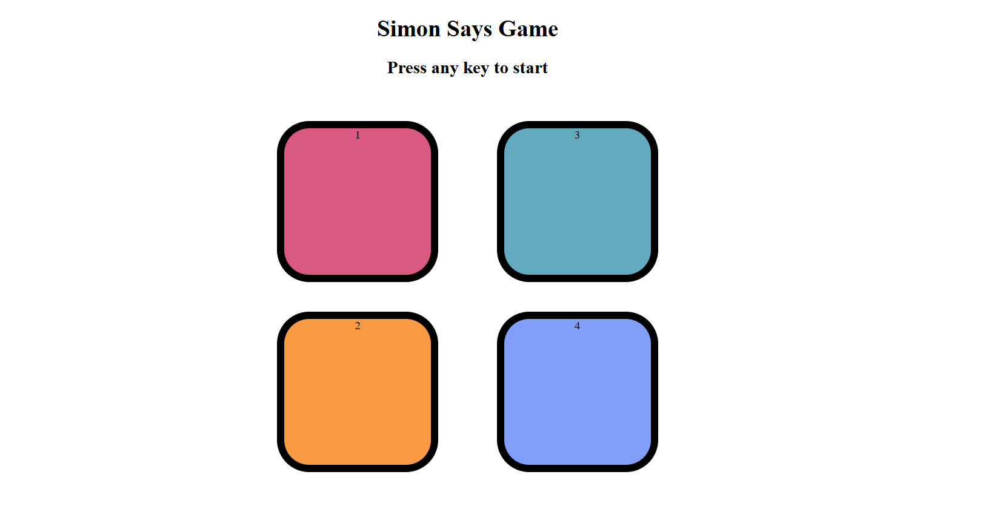

# 🎮 Simon Says Game

A fun and interactive memory game where you repeat the color pattern as long as you can. Inspired by the classic *Simon Says*!

---

## 📸 Preview


<!-- Replace this with your own screenshot -->

---

## 🚀 How to Play

1. Press any key to start the game.
2. Watch the flashing color pattern carefully.
3. Click the buttons in the same order.
4. Each level adds a new color to the sequence.
5. Game ends when you click the wrong button.
6. Your current and highest score are displayed!

---

## 🛠️ Features

- Colorful UI with button highlights and effects.
- Score tracking (current and highest).
- Flash and sound feedback.
- Built with only **HTML**, **CSS**, and **JavaScript** – no libraries!

---

## 🖥️ Tech Stack

- HTML5
- CSS3
- Vanilla JavaScript

---

## 📁 Project Structure

```bash
📦 simon-says/
├── index.html       # HTML structure
├── style.css        # Game styling
└── app.js           # Game logic
🌍 Live Demo
🔗 https://simonsaygamesjs.netlify.app/
